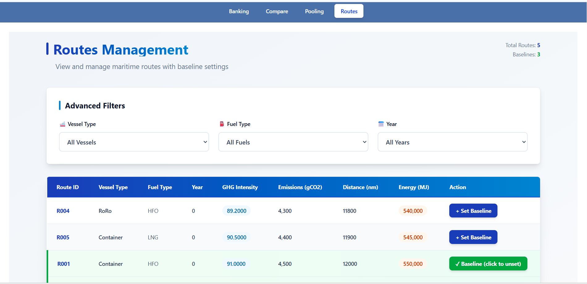
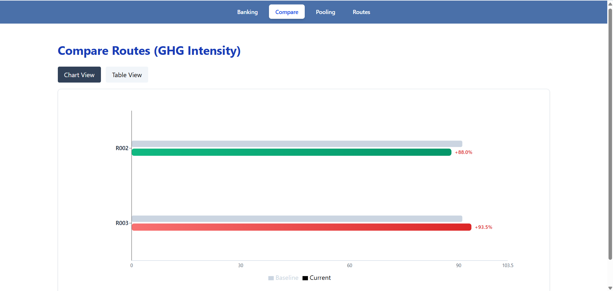
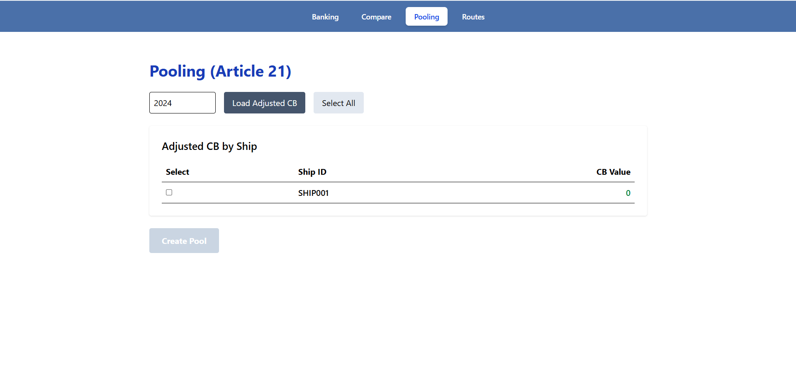

# ⚓ FuelEU Maritime Compliance Dashboard

### Complete Backend + Frontend Application with Banking, Pooling, CB Calculations & Comparison Analytics

Built with **Hexagonal Architecture**, **Prisma ORM**, **React + Recharts**, and **AI-Assisted Engineering**

---

## 📌 Overview

The **FuelEU Maritime Compliance Dashboard** is a full-stack application used to calculate, manage, and visualize EU maritime compliance metrics, including:

- **Compliance Balance (CB) calculations**
- **Adjusted CB after banking**
- **Article 20 Banking operations**
- **Article 21 Pooling formation**
- **Route-level baseline & comparison analytics**
- **Interactive charts and tables for decision-making**

# ⚓ FuelEU Maritime Compliance Dashboard

==============================================

### Complete Backend + Frontend — Banking, Pooling, CB Calculations & Route Comparison

A full-stack application that calculates, manages and visualizes FuelEU Maritime compliance metrics using a Hexagonal Architecture (Ports & Adapters) approach.

---

## Table of contents

- [Overview](#overview)
- [Features](#features)
- [Quick start](#quick-start)
- [Screenshots](#screenshots)
- [API snapshot](#api-snapshot)
- [Project structure](#project-structure)
- [Contributing](#contributing)
- [License & author](#license--author)

---

## Overview

The dashboard supports:

- Compliance Balance (CB) computations and adjusted CB after banking
- Article 20 banking operations (create / apply banked credits)
- Article 21 pooling formation and checks
- Route-level baseline and comparison analytics with percent-change calculations
- Frontend visualizations (charts and tables) for decision making

Domain logic is kept pure and independent from infrastructure (no fetch or DB in core).

---

## Features

### Core compliance

- CB snapshot & adjusted CB
- Banking (Article 20) and application of banked credits
- Pooling (Article 21) with eligibility rules
- Route baseline + percent-change analysis

### Frontend

- React + TypeScript + Vite
- Tailwind CSS for styling
- Recharts for charts

### Backend

- Node.js + Express
- Prisma ORM (PostgreSQL)
- Well-defined ports & adapters
- Vitest-powered unit and integration tests

---

## Quick start

1. Backend

```powershell
cd backend
npm install
# create .env with DATABASE_URL
npx prisma generate
npx prisma migrate dev
npm run dev

# run tests
npm run test
```

2. Frontend

```powershell
cd frontend
npm install
npm run dev
# open http://localhost:5173
```

---

## 📸 Screenshots

### 🔹 Route Tab



### 🔹 Compare Tab



### 🔹 Banking Tab


### 🔹 Pooling Tab



## API snapshot

- Compliance

  - `GET /compliance/cb` — get CB snapshot
  - `GET /compliance/adjusted-cb` — get adjusted CB

- Banking (Article 20)

  - `GET /banking/records?shipId=<id>&year=<year>` — list bank entries
  - `POST /banking/bank` — bank surplus
  - `POST /banking/apply` — apply banked amount

- Pooling (Article 21)

  - `POST /pools/create` — create pool with body `{ shipIds, year }`
  - `GET /pools/members?poolId=<id>`
  - `GET /pools/ship?shipId=<id>&year=<year>`

- Routes
  - `GET /compare/comparison` — compare routes vs baseline (returns array)
  - `POST /routes/:id/baseline` — set baseline for a route

---

## Project structure (high level)

```
/backend
  /src
    /core
    /adapters
    /infrastructure
/frontend
  /src
    /core
    /adapters
```

---

## Contributing

- Keep domain logic pure and unit-testable
- Implement ports in `adapters/` and wire them in the composition root
- Add unit tests for domain/use-cases and integration tests for controllers

---

## License & author

MIT — Dwiden Brahma
